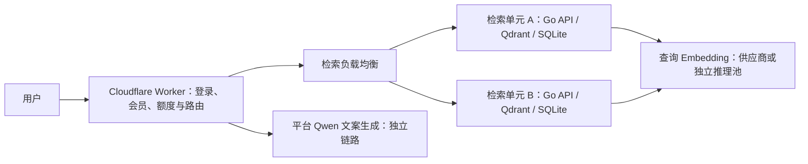

# 中文诗词语义检索：并发提升分析与实施顺序

日期：2026-09-22。基于已有 RN 压测、冻结索引、当前代码及官方文档。
本文是分析和待验证方案；没有修改运行配置、重新生成向量或实施扩容。
继续保留全量已有译文的自然语言语义检索、Docker 部署和宿主机目录持久化。

## 1. 结论与推荐路线

**当前约 2 QPS 不是全量诗词语义检索的固有上限。首要问题是 RN 的向量热数据
装不进给定的物理内存预算，查询不断从磁盘交换区读回数据。**

优先推荐：保留现有 BGE-M3 向量和句子级检索，先使用现代 CPU、8 GiB RAM、
可靠本地 SSD/NVMe 建立没有持续换页的基线，再调 embedding 并发和入口接纳控制。
第一阶段以稳定 10–20 QPS 为验收目标，后续按 50–100 QPS 评估完整检索副本。
这些是工程目标，**不是升级后的实测容量或硬件规格承诺**。

如果必须保留当前 RN 小内存配置，最值得验证的是：用已有原始向量重建
2-bit 二值量化 + 非对称查询量化的独立索引，把量化向量从约 1.64 GiB 压到约 0.41 GiB。
它不要求重新调用 embedding 模型，但必须同时验收中文召回质量和精排随机读开销。

结果缓存命中率低，不等于内存无法带来收益：不同问题仍然搜索同一个有限的诗词索引。
**让索引热数据驻留 RAM 不依赖用户重复提问。** 本方案的容量估算按查询结果缓存不命中计算。

## 2. 已证实的瓶颈与尚待验证的部分

| 证据 | 实际观测 | 能得出的结论 |
| --- | --- | --- |
| 中文 4 → 8 并发 | 2.19 → 2.22 QPS，p95 2.28 → 4.83 秒 | 更多在途请求主要增加等待 |
| Qdrant 内存预算 | 1,280 MiB，即 1.25 GiB | 是测试容器限额，不是 RN 全部内存 |
| RN 整机 RAM | 约 2.41 GiB | 放宽容器限额有一定空间，但整机也很紧张 |
| 中文查询资源 | Qdrant swap 约 790–815 MiB，CPU iowait 41%–54% | 换页和磁盘等待是首要已证实限制 |
| 向量查询窗口 | major fault 约增加 49 万次；CPU 配额节流增量为零 | 不支持先归因于 CPU 配额不足 |
| embedding 独立探测 | 4 并发短测达到 5.35 QPS | 高于当前中文完整接口，之后仍可能成为瓶颈 |
| 现有 API 短测 | 内存峰值约 40.79 MiB | 没有证据需要先重写 Go 服务或替换 SQLite |

已有中文 8 并发脚本以 p95 超过 4 秒触发失败阈值，48/48 HTTP 请求本身成功。
它是可复用的性能回归基线；后续须补固定到达速率和持续负载，不能只重复短闭环测试。
本次没有在清理后重测取消容器限额的整机极限，也没有同一请求的完整分阶段 tracing，
所以不能声称某一步占总耗时的准确百分比，或承诺单项修改提升几倍。

RN CPU 为 Xeon E5-2697 v2；归档 CPU flags 有 AVX、没有 AVX2。
现代 CPU/SIMD 有潜在收益，但在解除换页之前，不能把更换 CPU 当作已验证的主要解法。
英文模板短测约 9.7 QPS 与中文约 2 QPS 的差异还包含查询分布、访问局部性及预热差异，
不能简单解释为中文计算必然比英文慢。

## 3. 内存账本：问题不是“9 GiB 数据必须全部放进 RAM”

当前有 1,717,558 个句向量、389,593 部作品、1,024 维。
原始向量和 payload 在磁盘；INT8 量化数据与 HNSW 设置为内存方式。
`always_ram` 不是操作系统层面的禁止换出：内存不足时仍可发生 swap。

| 结构 | 冻结索引文件占用 / 计算值 | 说明 |
| --- | ---: | --- |
| 原始 Float32 向量矩阵 | 6.552 GiB | 当前不对结果做原始向量重评分，无需全量常驻 |
| INT8 量化文件 | 1.644 GiB | 已经超过 1.25 GiB 容器 RAM 限额 |
| HNSW 文件 | 108.14 MiB | 磁盘文件大小不等于加载后的堆内存 |
| payload 索引文件 | 138.66 MiB | 包含 dataset / generation 过滤索引 |
| payload 存储 | 477.80 MiB | 按需读取，不要求完整常驻 |
| 集合分配磁盘空间 | 约 9.01 GiB | 不是全部在线热数据，也不是进程 RSS |

仅按维度计算，INT8 为 `1,717,558 × 1,024 × 1 byte = 1.638 GiB`；
文件占用略大，还必须加 HNSW、ID 映射、过滤索引、进程和请求临时内存。
本地未施加 RN 小内存限制时，Qdrant Docker 内存曾约 2.03–2.08 GiB；
这支持“当前容器预算过小”，但不能把 Docker 统计当成所有部署的精确最低 RAM。

当前冻结集合有 1 个 shard、4 个有数据的 HNSW segment、1 个空追加 segment。
全部 1,717,558 个向量已经建立索引，状态 green；没有证据表明主要问题是未建索引或严重碎片。

## 4. 路线 A：先让现有检索工作集放进内存，风险最低

建议用 4 个现代 vCPU、8 GiB RAM、本地 SSD/NVMe 作为下一轮基准机器，
为 Qdrant 热数据、页缓存、API、系统及发布维护留余量。
4 GiB 可作为较低成本实验档，8 GiB 更适合作为持续服务的起点；
如果后续 CPU 或副本负载需要更多资源，再测试 8 vCPU / 16 GiB。
这些规格是实验预算，不能直接换算成确定 QPS。

具体顺序：

1. 复用同一冻结快照及 SQLite，保持模型、语料和查询算法不变。
2. 只改变可用内存，观察 swap 活动、major fault、memory/IO PSI 是否显著下降。
3. 给模型预先生成并保存一份多样中文评测查询向量，测纯检索以隔离模型波动。
4. 再测自然语言完整接口，确认瓶颈是否转移到 embedding。
5. 热数据仍放不下时先增加 RAM；装得下且 CPU 饱和时再增加核心或副本。

RN 不升级时，也可评估减少非必要常驻进程和放宽 1,280 MiB 容器限制。
但整机仅约 2.41 GiB，仍需系统和页缓存空间，不能把所有 RAM 分给 Qdrant。
当前 19.68 GiB 空闲磁盘是存储余量，不会变成物理内存。
不要通过关闭 swap 来掩盖问题：已有同预算冷启动测试在禁用 swap 后 OOM。

## 5. 路线 B：更强量化，优先复用已有 embedding

| 表示 | 全量向量理论体积 | 相对当前 INT8 | 主要代价 |
| --- | ---: | ---: | --- |
| INT8 | 1.638 GiB | 1 倍 | 当前方案 |
| 2-bit 二值量化 | 0.409 GiB | 约 1/4 | 召回损失，需要评估非对称查询与重评分 |
| 1-bit 二值量化 | 0.205 GiB | 约 1/8 | 信息损失更大，通常更依赖候选重评分 |

表格只算量化向量，不包含图、payload、运行时、对齐开销，也不代表磁盘总量。
原始 Float32 向量仍保留用于重评分、重建和回滚。

当前 Qdrant 1.15.5 支持自 1.15.0 引入的 2-bit / 1.5-bit 与非对称量化；
项目使用的 Go client 1.15.2 也有相应类型。
建议先测“存储向量 2-bit、查询向量 scalar8bits”，再决定是否评估更激进的 1-bit。
不要套用其他模型的官方演示召回率到 BGE-M3 中文诗词。

更强量化可以从磁盘上的原始向量离线生成，**不必为 171.8 万条文本重新调用 embedding**。
它减少常驻数据，可能直接解除换页瓶颈；但收益必须由本库实测证明。

要特别处理重评分：当前代码显式 `rescore=false`，已经省去了原始向量随机读。
二值量化若继续不重评分，质量可能下降；开启后又可能把瓶颈带回磁盘。
应同时比较不重评分，以及较小候选集的重评分，控制精排读取量。
内部候选数与最终返回 1 条是两件事；不能认为最终 top-1 配上小 oversampling
就已经精排了几十条候选。候选数、oversampling、ef 必须一起明确记录。

例如 20 个 Float32 候选约含 80 KiB 向量数据，100 QPS 时理论约 7.8 MiB/s；
这看似不大，但随机访问的 IOPS、页读取放大和尾延迟可能比带宽更关键。
它是数据量估算，不是实际磁盘读性能。

当前集合校验严格要求 INT8、m=16、HNSW 在内存。
实验配置应成为显式索引 profile，并同步调整导入/验证流程，避免未来导入拒绝新索引。
在独立集合和独立存储目录上测试，不直接改唯一可用的现有索引。
RN 约 19.68 GiB 空闲空间未必容得下新旧集合、快照和优化器临时副本的全部峰值，
优先在资源充足的构建机生成，再传输已验证快照。

当前官方文档还包含 v1.18+ TurboQuant、v1.19+ memory tiers；
不能把这些新参数直接用于本项目 1.15.5。升级及低比特新算法属于独立实验，不是本轮前提。

## 6. HNSW、过滤和分段：在大瓶颈解除后细调

- `hnsw_ef`：从现有 64 对照 32、48、96；较小 ef 少做搜索，但会损失召回。
  保留全量点不等于查询质量没有变化，不能只看速度。
- segment：现有 4 个有数据段可与 2 个较大段做吞吐对照。
  更多段可并行处理单次查询，也会增加每次查询的工作和调度；不能认为分段越多越快。
- generation：现有集合已经隔离版本，每次仍添加全量命中的 generation 条件。
  在启动时验证版本隔离、禁止混写并保留返回值版本检查后，可 A/B 移除重复过滤。
  对应索引文件约 69 MiB；这属于次要优化，不能宣称它解释了当前数量级差距。
- m：当前 16 合理，减小可能节省图内存，但收益远小于先解决 1.64 GiB 量化数据；
  需要重建及召回对照，不作为第一步。
- 把 HNSW 和量化数据进一步搬到磁盘可减少内存需求，但增加随机读，
  对已有高 iowait 的 RN 不应作为默认加速方案。

目前已启用 ANN、INT8、gRPC、连接复用、仅必要 payload、无返回向量；
rerank 也已关闭。这些不是尚未实施的新增收益。
`PoolSize=1` 的 gRPC 连接支持 HTTP/2 多路复用，不代表只能串行查询。

## 7. embedding：内存问题解决后的下一层扩容重点

所有新自然语言请求仍须生成查询向量。当前实际 embedding 并发为 4，
源码默认 16 不能当作运行值；在线 `Embed()` 每次只传 1 条文本。
`EMBEDDING_BATCH_SIZE` 是离线导入参数，调它不会自动给在线请求做批处理。

先按 4 → 8 → 16 → 32 逐级提高模型并发，观察真实调用耗时、429、队列和 p95。
同时核对 SiliconFlow 账号下该模型的 RPM/TPM。
官方明确额度按账号及模型计算，不按 API key；增加同账号 key 不会增加配额。

不依赖重复问题的另一种方法是微批处理：把不同用户的问题在 5–20 ms 的短窗口内
合并成一次 embedding 请求，再按响应 index 分发给原请求。
同时设置最大文本数与总 Token 限制，低流量及时发出，取消请求不再继续占队列。
接口文档声明文本数组最多 32 条，批量文本长度限制与单条模式不同，实施前需用当前模型验证。
不能为了凑满一批让用户等待几百毫秒。

微批处理减少请求次数及部分调度开销，**不会减少总 Token 数**。
20 QPS 下等待 20 ms 通常只能积累很小的批，不能照最大 batch 推算 32 倍收益。
更高且持续的流量才适合比较供应商专用容量与独立 GPU embedding 服务。
RN 当前 2.41 GiB 主机不适合同时承载向量库和高并发本地 BGE-M3 推理。

若自托管同一 BGE-M3，必须验证 tokenizer、pooling、归一化和预处理与旧库兼容，
不能只凭模型名相同就直接切换。更换 embedding 模型则要同时重建文档和查询向量体系。
Qwen/Qwen3.5-9B、4B 文案生成不在当前诗词检索压测链路中，不应混作 embedding 性能问题。

## 8. API 和 SQLite：减少无效工作，保持结构简单

现有保护阈值是 512 个 HTTP 在途、256 个不同检索任务；它们不是机器能承受的 QPS。
建议按真实容量设置入口速率、有限队列、短等待预算及分阶段并发限制。
模型供应商配额控制与本地 Qdrant 接纳控制分别处理；过载时明确返回可重试状态。
不要靠长队列或扩大超时把等待隐藏起来。

当前 embedding 的 5 秒预算包括等待 4 个槽位；检索共享任务使用
`context.Background()` + 10 秒，即使客户端离开也可能继续执行。
应在没有等待者时取消工作；保留 singleflight 时必须等最后一个等待者离开，
不能绑定第一个用户的取消事件而误伤其他用户。

长期独立查询还会填满两个默认 32 MiB 缓存，64 MiB 只是逻辑内容预算，
不含 map/list、键和 Go 对象开销。RN 压测 API 限制只有 96 MiB，短测峰值低不代表长测安全。
低命中率时缩小缓存或实现明确的禁用选项，将内存优先留给索引；当前配置不接受简单填 0。

SQLite 当前是只读主键/范围读取，8 个连接不是 8 QPS 上限，没有证据要先换 PostgreSQL。
若后续发现长作品分段解析成为瓶颈，再离线生成直接按句 ID 取原文、译文、标题和作者的
serving 表，避免在线读取前段并计算全文句序号。它仍可作为宿主机上的只读 SQLite 发布。
不要为少一次回表就把所有全文复制进当前内存紧张的 Qdrant payload。

## 9. 更大的数据布局改动：有价值，但不是免费提速

目前平均每部作品约 4.41 个句向量。
改成每部作品一个向量，数量可从 171.8 万降到约 39 万，INT8 理论约 0.372 GiB。
但整首诗表示可能稀释其中一句的细节意境，改变当前句级匹配质量。

更可控的实验是“作品/短段粗召回 → 候选作品内句向量精排”，或一首诗保留多个段向量。
全量作品仍可参与粗召回，但第一阶段漏掉的作品无法靠第二阶段找回，必须测作品及句子召回。
直接均值池化现有句向量无需模型调用，但不等价于整首译文重新 embedding，需独立验证。

把 BGE-M3 1024 维直接截成 256 维并不安全；它没有在本项目验证过这样的维度契约。
PCA 投影可以离线复用旧向量，但查询端必须应用同一投影，且会改变距离与召回。
换成支持缩维的其他模型则需全库重新 embedding，应在前面的低成本路线之后考虑。

BM25、按主题分类或只搜索热门诗词可用于辅助召回，不能代替用户要求的全量自然语言语义能力。
更换为 Faiss、其他向量库或专用静态索引也无法消除模型额度和内存需求；
只有 Qdrant 运行时开销经 profiling 被证实成为主要问题后，重写才有充分收益依据。

## 10. 50–100 QPS 及更高目标：扩完整检索单元

优先把现有数据视为不可变版本发布。每个副本带自己的 API、Qdrant 存储和匹配的 SQLite，
负载均衡分发不同请求；多个 API 共用同一台内存不足的 Qdrant 不会线性增容。

复制全库适合当前约 9 GiB 的静态索引：每个请求由一个完整副本完成，便于发布和回滚。
每个副本使用独立宿主机目录，不能让多个 Qdrant 进程并发读写同一存储目录。
Qdrant 自身仍需要可写目录；“业务只读”不等于把它的整个运行目录挂载为只读。
采用快照恢复或干净停止的完整副本，匹配 generation、embedding/index profile 和 SQLite 校验值。

分片解决单机数据或计算放不下的问题；全库搜索通常需要向多个分片发请求再合并，
不能把分成 4 片当成天然 4 倍吞吐。当前优先验证完整副本，避免过早引入集群复杂度。
所有副本共享供应商账号额度，模型层必须同步扩容并实行总量控制。

容量规划可写为：

`Q ≤ min(向量服务能力, C×B/Tembed, RPM×B/60, TPM/(60×每查询平均Token), 回表能力)`

其中 C 是活跃 embedding 调用数，B 是实际平均 batch，Tembed 是平均每批耗时；
它是上界估算，还要留波动、排队和故障余量。
稳定系统中平均在途数约等于 QPS × 平均响应秒数；100 并发不等于 100 QPS。

| 验收目标 | 无微批时模型请求需求 | 建议验证重点 |
| --- | ---: | --- |
| 10–20 QPS | 600–1,200 RPM | 单机解除换页，调整 embedding 槽位及配额 |
| 50–100 QPS | 3,000–6,000 RPM | 现代 CPU、完整副本、模型批处理与总量控制 |
| 1,000 QPS | 60,000 RPM | 独立推理容量规划、多个检索单元、故障与持续压力测试 |

例如 100 QPS、embedding 平均 0.5 秒，单条调用理论上已有约 50 个模型请求同时在途。
1,000 QPS 若实际平均 batch=16，则约 3,750 次批请求/分钟，但仍要处理每秒 1,000 段文本。
副本数依据达到目标 p95 时的实测单机吞吐计算，再留 30%–40% 余量及故障冗余，
不能在获得单机新基线前承诺需要几台。

Cloudflare Worker 继续承载平台统一调用、会员和入口逻辑，不能替代向量库的 RAM/CPU。
现有 Cloudflare 代理测试显示动态请求可能绕路，且 Bot Fight Mode 拦截部分 API 客户端。
源站选址、Worker 位置、模型链路和防护设置需单独验收；网络变快不等于查询吞吐自动提高。

## 11. 可执行的验证顺序和质量门槛

| 顺序 | 实验 | 保持不变 | 主要判据 |
| --- | --- | --- | --- |
| 0 | 加分阶段计时、队列/错误分类 | 当前模型和索引 | 能区分模型等待、ANN、回表和公网耗时 |
| 1 | 同硬件增内存或在新硬件建立基线 | 同一语料、向量与查询参数 | 换页显著消失，ANN p95 和持续 QPS 改善 |
| 2 | embedding 4/8/16/32 | 已稳定的 ANN 配置 | 端到端收益、供应商 429、排队与配额 |
| 3 | ef、segment、冗余过滤单项 A/B | 模型与质量评测集 | 同质量下的性能变化 |
| 4 | 2-bit 非对称量化及候选重评分 | 原始向量与语料 | 内存、召回、p95 和磁盘随机读一起改善 |
| 5 | 微批及完整副本 | 已通过验收的单机检索 | 固定到达速率下容量可扩展，账号配额不超限 |
| 6 | 作品/段级粗召回或更换模型 | 全语料覆盖要求 | 质量收益/损失与重建成本值得承担 |

拆成两套负载：预生成中文查询向量测 ANN 容量；独立中文自然语言输入测完整在线链路。
每种配置使用相同分布的查询，不把 128 条反复使用的语料向量当作广泛中文访问负载。
关闭或统计查询结果缓存，向量层及操作系统页缓存按实际生产方式保留，并分别记录冷/热启动。

先阶梯到达速率 5/10/20/50/100 QPS，超标即停止提升，每档至少 5–10 分钟；
候选配置再持续 30–60 分钟，后续覆盖业务高峰。不能让闭环客户端变慢自动降低发压速度，
也不能把立即拒绝的 429/503 算成功吞吐。

建议第一阶段目标：20 QPS 下源站完整语义接口 p95 ≤ 2 秒、成功率 ≥ 99.9%、
队列不持续增长、没有 OOM 和持续换页；这是待验证目标，公网及 Qwen 生成另行统计。
短测不足以证明长期 99.9% SLA，需同时报告请求数和错误数。

质量评测至少覆盖数百条中文意图、冷门作品、跨主题及长短输入：
用原始 Float32 精确检索建立 ANN 对照，记录 recall@10、top-1 一致性，
再独立评价最终返回诗句的语义相关性。当前 INT8 结果不是“绝对正确答案”。
可先以 recall@10 ≥ 95%、最终相关性不明显下降为实验门槛，再按样本结果调整；
不得以全量点仍在或 HTTP 200 代替召回质量验收。
所有索引完成建图后再测；当前 `indexed_only=true` 会跳过尚未索引的段，
切换前须重新核对全量计数和 indexed count，避免通过漏搜语料获得虚假提速。

## 12. 证据与参考

- [RN 实机总报告](report.md)、[资源分析](actual-rn/resource-analysis.md)、
  [中文 8 并发原始结果](actual-rn/cn-c8.json)、[模型探测](actual-rn/embedding_probe.json)
- [本地全链路](local/report.md)、[内存限制与 OOM 对照](envelope/report.md)、
  [网络专项报告](network/report.md)
- [冻结集合配置](envelope/storage/collections/poetry_sentences_20260921_v1/config.json)、
  [语料完成记录](../../corpus/poetry-20260921-v1/completion_report.json)；
  文件体积统计来自该冻结集合的原始向量、量化、HNSW 和 payload 目录，未启动实例。
- [集合布局与校验](../../../internal/qdrantstore/collection.go)、
  [查询参数与过滤](../../../internal/qdrantstore/store.go)、
  [检索调度与取消](../../../internal/search/service.go)
- [模型连接与超时](../../../internal/siliconflow/client.go)、
  [在线 embedding](../../../internal/siliconflow/search.go)、
  [SQLite 回表](../../../internal/repository/lookup.go)、
  [Docker 与持久化说明](../../../docs/vector-search-docker.md)
- [Qdrant 量化及版本说明](https://qdrant.tech/documentation/guides/quantization/)
- [Qdrant 容量规划](https://qdrant.tech/documentation/capacity-planning/)
- [Qdrant 性能配置](https://qdrant.tech/documentation/ops-optimization/optimize/)
- [Qdrant 分布式部署](https://qdrant.tech/documentation/scaling/distributed_deployment/)
- [SiliconFlow embedding API](https://docs.siliconflow.cn/en/api-reference/embeddings/create-embeddings)
- [SiliconFlow 限流规则](https://docs.siliconflow.cn/en/userguide/rate-limits/rate-limit-and-upgradation)

官方文档查询日期为 2026-09-22；具体功能与字段按本项目 Qdrant / SDK 版本核对。
