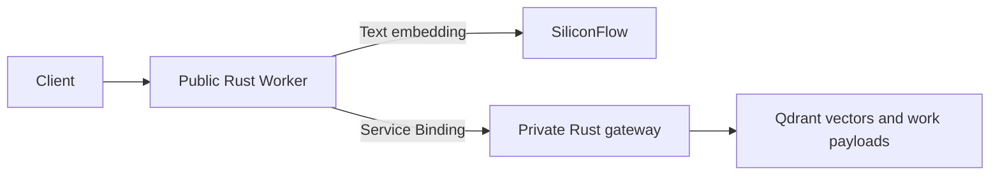

# Rust Workers with Qdrant: verified experiment

The existing Go API routes have Rust implementations deployed on Cloudflare Workers.
Vectors and canonical work data remain in Qdrant. There is no D1 binding or D1 access in
the final runtime. Cold text throughput improved in the measured workload, but direct
vector searches and cached searches did not consistently outperform BWG. Production Go
and DNS remain in place; this experiment does not justify an unconditional cutover.

## Deployed API

- Base: `https://poetry-rust-lab-20260930.963600436.workers.dev/poetry`
- Routes: `POST /search`, `GET /poems/{work_id}`, `GET /health`.
- Authentication: the existing private Bearer token.
- Main Worker: `poetry-rust-lab-20260930`, version `9d11caf3-fa52-4c94-a158-77ad77018fe2`.
- Private gateway: `poetry-qdrant-gateway-20260930`, version
  `44dbe14d-89f1-417b-820e-03f2f766ee44`.
- Main uses default edge placement. The gateway configuration targets AWS us-west-1;
  live metadata reports targeted placement, whose numeric region mapping is not verified.
- Gateway workers.dev and preview URLs are disabled; access uses a Service Binding.
- Model: free `BAAI/bge-m3`, 1024 dimensions. No corpus vectors were recomputed.
- Deadlines: model 8 s, gateway external I/O 5 s, internal call 7 s, complete request 10 s.
- Authenticated, validated successful responses use a one-hour, location-local cache.

The runtime does not call BWG. A cold search performs a vector query and then a work
payload lookup to resolve the exact original sentence. The Go baseline performs one
Qdrant query and reads the original from local SQLite. These different data paths and
regional hops matter when interpreting latency; the comparison does not isolate language speed.

## Data and Correctness

`poetry_tang_20260922_v1` retains 127,031 logical 1024D Cosine vectors.
`poetry_tang_api_20260930_v1` contains 43,420 canonical work payloads and zero vectors.
The work payload collection supplies originals, translations, and interpretations for
the existing response contract. It is stored in Qdrant, not Cloudflare.

Both collections were GREEN with optimizer status OK before and after the final probe.
Indexed vector count 127,159 includes 128 previously recorded tombstones; it does not
represent 128 additional logical corpus vectors. Incomplete additive fields from an
earlier enrichment attempt are retained and are not used by the final API.

Validation completed: 12 Rust tests, strict Clippy, formatting, and release WASM build.
Live HTTP/2 validation passed 22 API cases, 32 identical-vector parity cases, 9 boundary
cases, and 32 independent cold text requests. Identical-vector scores use tolerance
`1e-5`. Independently generated text embeddings can vary; cold text validation checks
that each returned original belongs to the returned work instead of requiring equal scores.

Final post-load checks passed 6/6: Worker health/search/detail, production search/detail,
and production's intentionally private public health route returning 404. BWG loopback
health separately returned `status=ok` and generation `poetry-20260921-v1`.
Both `poetry-api` and `caddy` services were active. Owned load and monitor processes ended.

Evidence: [live validation](evidence/gateway-h2-final-validation.json),
[post-load routes](evidence/final-api-health-verified.json),
[BWG internal health](evidence/bwg-final-internal-health.json), and
[live deployment metadata](deployment-gateway-after-load.json).

## Bounded Load Results

Generator: RN; HTTP/2, persistent connections, closed-loop clients, no retries.
RPS is successful completions divided by actual elapsed time, including outstanding
completions. Each stage has a hard request budget and stops on an observed error rate
above 5%. These experiments establish measured operating points, not absolute capacity.

| Rust workload | Concurrency | Success / requests | Actual seconds | RPS | P95 seconds | Cache HIT |
| --- | ---: | ---: | ---: | ---: | ---: | ---: |
| Cold vector | 16 | 498 / 498 | 10.293 | 48.38 | 0.370 | 0% |
| Cold vector | 128 | 500 / 500 | 4.661 | 107.27 | 1.495 | 0% |
| Cold vector, longer run | 64 | 6000 / 6000 | 53.966 | 111.18 | 0.729 | 0% |
| Cold text | 16 | 227 / 227 | 15.772 | 14.39 | 2.415 | 0% |
| Cold text | 32 | 250 / 250 | 8.407 | 29.74 | 1.503 | 0% |
| Repeated search | 128 | 3000 / 3000 | 8.777 | 341.80 | 1.452 | 98.83% |
| Repeated search | 512 | 3000 / 3000 | 2.761 | 1086.55 | 0.861 | 99.60% |
| Repeated detail | 128 | 3000 / 3000 | 2.819 | 1064.12 | 0.313 | 96.67% |
| Repeated detail | 256 | 3000 / 3000 | 1.753 | 1711.35 | 0.404 | 100% |
| Cold vector, synchronized telemetry | 64 | 900 / 900 | 8.584 | 104.84 | 1.048 | 0% |

Total: 20,375 load-stage requests, all successful. Warmup and contract checks are additional.
The longer vector run was configured for 60 s but reached its 6000-request budget after
53.966 s. Cache stages were configured for 8 s; actual durations are shown above.
Most stages ended early on their budgets, so 512 cached clients is a tested burst point,
not a sustainable maximum. Vector ramp measurements preceded the final model timeout
adjustment; that adjustment changed only text embedding waits.

| BWG Go baseline | Concurrency | Actual seconds | RPS | P95 seconds |
| --- | ---: | ---: | ---: | ---: |
| Cold vector | 16 | 30.115 | 161.28 | 0.134 |
| Cold text | 16 | 31.640 | 7.74 | 3.132 |
| Repeated search | 128 | 15.087 | 925.30 | 0.214 |
| Repeated detail | 128 | 15.142 | 948.91 | 0.212 |

At the same 16-client concurrency, cold text throughput increased about 1.86 times,
with P95 reduced about 23%. Direct vector queries were slower. Cached search at 128
clients was also slower in this run; higher-concurrency results cannot be presented as
same-concurrency gains. Detail throughput was higher in the short 128-client test, but
P95 was worse and the measurement window was much shorter. Tests used the same generation
and Qdrant collection, at different times; provider load and network conditions can vary.

Raw results: [vector ramp](evidence/rn/gateway-vector-ramp.json),
[longer vectors](evidence/rn/gateway-vector-sustained.json),
[cold text](evidence/rn/gateway-text.json), [cached search](evidence/rn/gateway-hot.json),
[detail](evidence/rn/gateway-detail.json), and [Go baseline](bwg-baseline-summary.json).

## Resource Evidence and Remaining Limits

The synchronized probe launched the load and telemetry from one RN process. Its interval
was 17:55:59.835185829 through approximately 17:56:08.419314613 UTC on September 30.
Five telemetry requests overlapped the interval, but the first retained an idle CPU
window. Four active-load readings were 0.3342, 0.4623, 0.4498, and 0.4551 process cores.
The last three are about 90-92.5% of advertised 0.5 vCPU. This supports a tight Qdrant
CPU budget as a contributing constraint, without proving an enforced sustained ceiling.
Peak reported resident memory was 279.25 MiB; this is allocator telemetry, not complete
cgroup memory or disk headroom. The earlier longer-run samples were post-load and cannot
be used to claim CPU saturation during that run.

BWG's Go vector baseline had 69 CPU-throttled periods, with API memory near 70.7 MiB.
Moving API requests into Workers removes that BWG process constraint for those requests.
It does not remove Qdrant compute limits, sequential regional round trips, model latency,
or provider RPM/TPM restrictions. BWG monitoring ending at 16:52 UTC does not overlap the
final gateway runs; its absence of OOM events is not final-load resource evidence.

| Official main Worker analytics window | CPU P50 / P95 / P99, ms | Runtime errors |
| --- | --- | ---: |
| Longer vector run | 3.433 / 4.390 / 9.629 | 0 |
| Cold text and control window | 10.155 / 13.908 / 24.079 | 0 |
| Cached search | 1.538 / 3.312 / 8.505 | 0 |
| Detail | 1.003 / 1.913 / 5.054 | 0 |
| Synchronized vector probe | 3.967 / 6.249 / 12.622 | 0 |

No exceededCpu or exceededMemory status was observed in these final windows. Nevertheless,
text and some vector CPU quantiles exceed Workers Free's nominal 10 ms request budget.
Successful responses do not establish sustained free-plan reliability. Gateway-specific
analytics returned no rows, which means unavailable evidence, not zero CPU or usage.
Two Workers do not establish an effective combined 20 ms entitlement for an API request.

At 18:01:22 UTC, account analytics estimated 70,115 invocations, leaving 29,885 against
100,000 daily requests. Adaptive invocations are not a verified external billing counter;
counts lag and may include internal calls. The account-wide daily error estimate was 8,
including earlier failed experiments, while the final load windows showed zero runtime errors.
The next UTC reset is October 1 at 00:00, or 08:00 in Asia/Shanghai. No D1 calls were made
by the final runtime or these load probes; the previously halted D1 import stays halted.

Evidence: [synchronized telemetry](evidence/rn/gateway-vector-synchronized-resources.json),
[independent interval review](gateway-vector-synchronized-review.json),
[official vector CPU](final-probe-ingested-main-metrics.json),
[final collection health](qdrant-final-health.json), and
[BWG monitor interval](evidence/bwg-final-worker-resources.jsonl).

## Earlier Experiments and Model Choice

Earlier direct-placement and shared-executor experiments are retained in `evidence/rn`.
The shared path produced blank HTTP 500 responses and was removed. An exception stack
was not captured, so the exact cause is unverified. Older D1, placement, or failed-run
figures are not evidence for the final Qdrant gateway architecture.

The separate SiliconFlow test found that Pro BGE-M3 improved same-concurrency 16-client
throughput by about 16%, but 32-client Pro runs encountered HTTP 429 RPM limits.
Pro is priced at CNY 0.07 per million input tokens and is not free. It is not enabled
in the final Worker. Eight identical query samples produced identical free/Pro vectors;
that is useful compatibility evidence, not an exhaustive equivalence proof.
See [the model comparison](../pro-worker-20260930/pro-findings.md).

## Production Decision

On October 1 in Asia/Shanghai, the user chose to continue serving production from BWG.
The active deployment remains source-built Go with Qdrant Cloud and free `BAAI/bge-m3`.
The existing Cloudflare DNS route is retained. Rust Workers remain experimental and are
not adopted for production; no additional Worker load testing is planned for this task.
No database cleanup, new mutations, or production configuration changes were performed
when confirming this decision.
